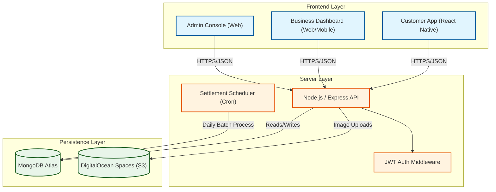
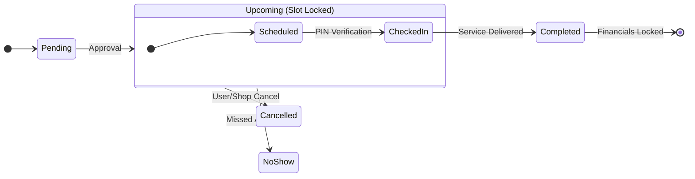

# Project Pitch: HairOne Marketplace

**Empowering Local Barbers, Simplifying Personal Care.**

---

## 1. Executive Summary

HairOne is a hyper-local marketplace connecting customers with nearby salons and independent barbers. Unlike generic booking tools, HairOne handles the **entire lifecycle**: from geospatial discovery and real-time slot availability to split-payments and automated financial reconciliation.

### Value Proposition
| Stakeholder | Benefit |
| :--- | :--- |
| **Customer** | "Book a haircut in 3 taps." No phone calls, no waiting. Real-time availability. |
| **Shop Owner** | A complete "Business in a Box" (Scheduling, CRM, Finance, Portfolio). |
| **Platform** | A scalable, commission-based revenue model with automated settlements. |

---

## 2. System Architecture

The system is designed for **high availability** and **scalability**, utilizing a micro-services approach within a monolithic repo for ease of deployment.



---

## 3. The Revenue Engine (Financial Flow)

A key competitive advantage is the **Automated Split-Settlement System**, capable of handling mixed payment methods (Cash vs. Online) and reconciling them daily.

```mermaid
sequenceDiagram
    autonumber
    participant C as Customer
    participant P as Payment Gateway
    participant S as Shop
    participant A as Platform (Admin)
    participant L as Ledger (DB)

    box "Booking Transaction" #f9f9f9
    alt Cash Payment
        C->>S: Pays Cash
        S->>L: Update Booking (Completed)
        L->>L: Debit Shop (Commission)
    else Online Payment
        C->>P: Pays Digital
        P->>A: Funds Settled
        A->>L: Update Booking (Completed)
        L->>L: Credit Shop (Net Revenue)
    end
    end

    box "Nightly Settlement" #e3f2fd
    A->>L: Cron Job Trigger (00:00)
    L->>L: Aggregate Debits & Credits
    alt Net Positive (Admin owes Shop)
        A->>S: Payout Initiated
    else Net Negative (Shop owes Admin)
        S->>A: Collection Invoice Sent
    end
    end
```

---

## 4. Booking Lifecycle & State Machine

The system eliminates "No-Shows" and "Double Bookings" using a robust state machine with **PIN Verification** at the point of service.



---

## 5. Technology Stack

| Layer | Technology | Key Capabilities |
| :--- | :--- | :--- |
| **Frontend** | **React Native (Expo)** | Unified codebase for iOS, Android, and Web. Over-the-air updates. |
| **Backend** | **Node.js + Express** | High concurrency, shared TypeScript types, extensive package ecosystem. |
| **Database** | **MongoDB** | Geospatial queries (`$nearSphere`) for location features. Aggregation pipelines for analytics. |
| **Storage** | **AWS S3 / DigitalOcean** | Scalable object storage for high-res gallery images. |
| **DevOps** | **Docker + Cron** | Containerized deployment with automated background workers. |

---

## 6. Scalability & Future Roadmap

### Core Capabilities
*   **Geospatial Search:** Efficiently indexes shop locations for radius-based discovery.
*   **Security:** JWT-based stateless authentication with strict Role-Based Access Control (RBAC).
*   **Data Integrity:** Multi-document ACID transactions ensure financial accuracy.

### Strategic Roadmap
1.  **Inventory Management:** Integrated POS for shops to sell retail products (Gels, Shampoos).
2.  **Loyalty Engine:** Automated retention tracking ("Buy 10, Get 1 Free").
3.  **Staff Permissions:** Granular access control for individual barbers within a shop organization.
4.  **AI Recommendations:** Personalized service suggestions based on booking history and cycle.
